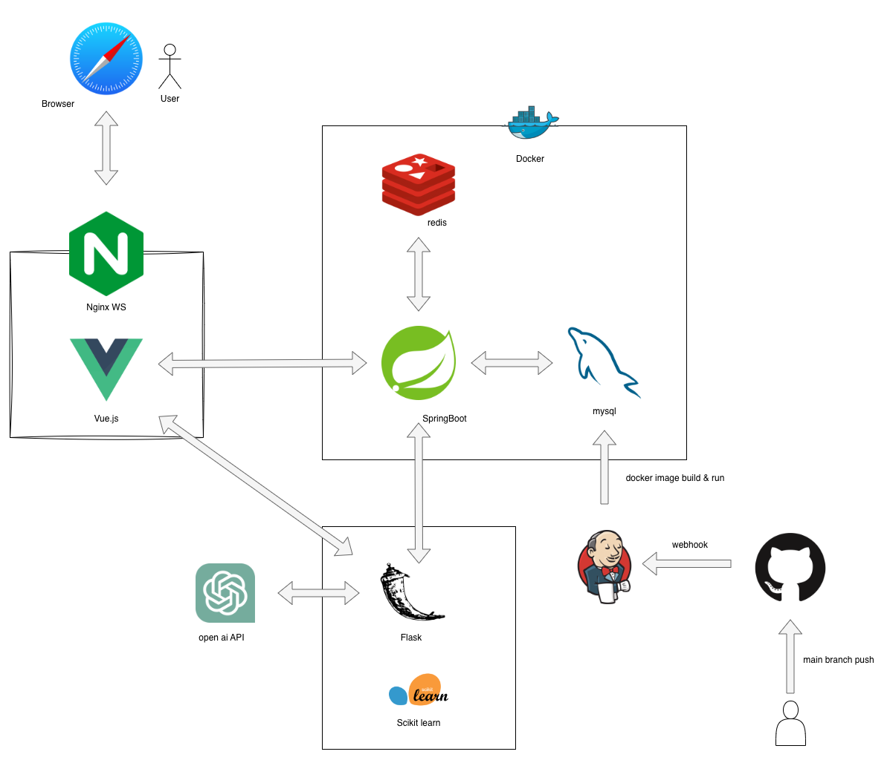

# GetMoim-Backend
프로젝트 GetMoim의 백엔드 서버입니다.

REST API로 설계되었으며 클라이언트와 통신합니다. 
프론트엔드는 포함되어 있지 않으며 클라이언트와 통신하는 API만을 제공합니다.

## 프로젝트 아키텍쳐

## 주요 구현 기능
- Spring Security를 사용한 JWT 토큰 기반 인증
- Spring Data JPA를 사용한 데이터베이스 연동
- Spring Data Redis를 사용한 JWT 토큰 관리
- **Jenkins를 사용한 CI/CD 파이프라인 구축**
- Docker를 사용한 컨테이너화
- FLASK를 사용한 추천 알고리즘 서버 연동
- **Jpa Criteria를 사용한 동적 쿼리 생성**

## 사용 기술
- Java 17
- Spring Boot / Security / JPA
- DB / Redis / MySQL
- Jenkins
- Docker
- Flask
- Jpa Criteria
